# Vasanth T

### Product builder & open-source maintainer at [Gitlawb](https://github.com/Gitlawb).

I work at **Gitlawb**, building products and maintaining open-source projects across AI coding tools, infrastructure, and onchain applications.

My work spans implementation, code review, and ongoing maintenance: model integrations, Windows compatibility, trading interfaces, security fixes, and the tests that keep them working.

[Gitlawb contributions](#gitlawb-contributions) · [My projects](#things-im-building) · [@BuildWithBeast](https://x.com/BuildWithBeast) · [Email](mailto:vasanth.dev@outlook.com)

## Gitlawb contributions

<picture>
  <source media="(max-width: 640px) and (prefers-color-scheme: light)" srcset="./assets/contributions-light-mobile.svg" />
  <source media="(max-width: 640px)" srcset="./assets/contributions-dark-mobile.svg" />
  <source media="(prefers-color-scheme: light)" srcset="./assets/contributions-light.svg" />
  
</picture>

Public merged PRs through September 11, 2026. <a href="./data/README.md">Source data and chart notes</a>.

<strong>Explore all 6 projects and merged pull requests</strong>

| Project | Work across our projects | Merged PRs |
| :--- | :--- | ---: |
| **[Zero](https://github.com/Gitlawb/zero)** | Terminal AI tooling, model/provider integrations, Windows compatibility, and reliability. | **[141](https://github.com/Gitlawb/zero/pulls?q=is%3Apr+is%3Amerged+author%3AVasanthdev2004)** |
| **[OpenClaude](https://github.com/Gitlawb/openclaude)** | Context management, provider behavior, credentials, and cross-platform fixes. | **[38](https://github.com/Gitlawb/openclaude/pulls?q=is%3Apr+is%3Amerged+author%3AVasanthdev2004)** |
| **[Node](https://github.com/Gitlawb/node)** | Push authorization, graceful shutdown, observability, and database migrations. | **[5](https://github.com/Gitlawb/node/pulls?q=is%3Apr+is%3Amerged+author%3AVasanthdev2004)** |
| **[Openlaunch](https://github.com/Gitlawb/openlaunch)** | Product UI, live trading charts, wallet identities, and token avatars. | **[2](https://github.com/Gitlawb/openlaunch/pulls?q=is%3Apr+is%3Amerged+author%3AVasanthdev2004)** |
| **[Node Explorer](https://github.com/Gitlawb/node-explorer)** | Explorer UI, search, documentation, and accessible mobile navigation. | **[2](https://github.com/Gitlawb/node-explorer/pulls?q=is%3Apr+is%3Amerged+author%3AVasanthdev2004)** |
| **[OpenClaude Skills](https://github.com/Gitlawb/openclaude-skills)** | Registry validation and trust-metadata hardening. | **[1](https://github.com/Gitlawb/openclaude-skills/pulls?q=is%3Apr+is%3Amerged+author%3AVasanthdev2004)** |

Public authored PRs merged as of September 11, 2026. Counts are a snapshot; each number links to the latest results.

### A few changes behind those numbers

- **Keeping agent sessions reliable.** Preserved [model choices when Zero’s specialist sessions resume](https://github.com/Gitlawb/zero/pull/1009) and prevented [repeated automatic compaction in OpenClaude](https://github.com/Gitlawb/openclaude/pull/636).
- **Making everyday setups work.** Worked on [proxy support in Zero](https://github.com/Gitlawb/zero/pull/1025) and [Windows credential handling in OpenClaude](https://github.com/Gitlawb/openclaude/pull/941).
- **Building the product experience.** [Rebuilt Openlaunch’s interface and hardened live market charts](https://github.com/Gitlawb/openlaunch/pull/8), then added [distinct wallet identities and token mosaics](https://github.com/Gitlawb/openlaunch/pull/13).
- **Strengthening the infrastructure.** Made [owner-only push authorization the default in Node](https://github.com/Gitlawb/node/pull/330) and added [graceful shutdown with opt-in metrics](https://github.com/Gitlawb/node/pull/22).

[Browse all my public Gitlawb merged PRs →](https://github.com/pulls?q=is%3Apr+is%3Amerged+is%3Apublic+author%3AVasanthdev2004+org%3AGitlawb)

## Things I’m building

**[Game Save Genie](https://github.com/Vasanthdev2004/Game-Save-Genie)** 
Automatic, versioned game-save backups to cloud storage you control, built on Ludusavi and rclone. Windows backups are stable; cross-machine sync is in beta.

**[MoneyKernel](https://github.com/Vasanthdev2004/moneykernel)** 
Spending controls for AI agents: budgets, exact-order approvals, and verifiable receipts. Live market data with paper execution.

**[Kred](https://github.com/Vasanthdev2004/kred)** 
Verifiable income statements and shareable proof from onchain payment history. Currently an Arc Testnet MVP.

## Tools I work with

**Languages** · `Go` `TypeScript` `Python` `Solidity` 
**Product** · `React` `Next.js` `Tailwind CSS` 
**Systems** · `Node.js` `PostgreSQL` `GitHub Actions` `Linux` `Windows`

---

**Have something useful in mind? Let’s build it.** 
Open to product engineering opportunities and open-source collaboration.

[vasanth.dev@outlook.com](mailto:vasanth.dev@outlook.com) · [Follow @BuildWithBeast](https://x.com/BuildWithBeast) · [Explore my repositories](https://github.com/Vasanthdev2004?tab=repositories)
