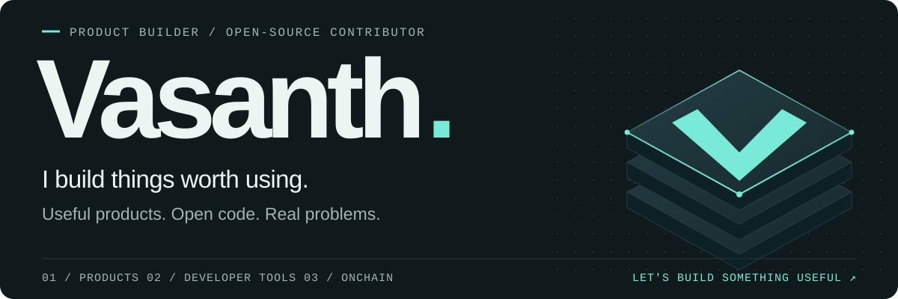

<picture>
  <source media="(max-width: 640px) and (prefers-color-scheme: light)" srcset="./assets/header-light-mobile.svg" />
  <source media="(max-width: 640px)" srcset="./assets/header-dark-mobile.svg" />
  <source media="(prefers-color-scheme: light)" srcset="./assets/header-light.svg" />
  
</picture>

  <a href="#selected-builds">Selected builds</a> &nbsp; / &nbsp;
  <a href="#in-the-open">Open source</a> &nbsp; / &nbsp;
  <a href="https://x.com/BuildWithBeast">Build with me ↗</a> &nbsp; / &nbsp;
  <a href="mailto:vasanth.dev@outlook.com">Say hello ↗</a>

 

I’m **Vasanth**, a product builder and open-source contributor. I make tools for developers, players, and people building onchain. I like taking an idea through the whole journey: the interface, the system behind it, and the details that make it hold up in everyday use.

You’ll find me building my own projects, contributing to [Gitlawb](https://github.com/Gitlawb), and working through the less glamorous parts of shipping: debugging, compatibility, tests, and code review.

## Selected builds

<table>
  <tr>
    <td width="80" align="center">
      
    </td>
    <td>
      <h3><a href="https://github.com/Vasanthdev2004/Game-Save-Genie">Game Save Genie ↗</a></h3>
      
Your progress deserves a backup. Automatic, versioned game-save backups to cloud storage you control, built on Ludusavi and rclone.

      
<b>Python</b> · Self-hosted · Windows backups stable; cross-machine sync in beta

    </td>
  </tr>
  <tr>
    <td width="80" align="center">
      
    </td>
    <td>
      <h3><a href="https://github.com/Vasanthdev2004/moneykernel">MoneyKernel ↗</a></h3>
      
Spending controls for AI agents. Set budgets, approve exact orders, and keep verifiable receipts for every simulated trade.

      
<b>TypeScript · React · PostgreSQL</b> · Live market data, paper execution

    </td>
  </tr>
  <tr>
    <td width="80" align="center">
      
    </td>
    <td>
      <h3><a href="https://github.com/Vasanthdev2004/kred">Kred ↗</a></h3>
      
Make onchain work easier to account for. Turn payment history into verifiable income statements and shareable proof.

      
<b>Next.js · Solidity · PostgreSQL</b> · Arc Testnet MVP

    </td>
  </tr>
</table>

## In the open

I contribute to projects I use and care about, from the first interaction to the difficult edge cases.

| Project | Where I’ve contributed |
| :--- | :--- |
| **[Zero](https://github.com/Gitlawb/zero)** | Terminal AI tooling: [model selection on resume](https://github.com/Gitlawb/zero/pull/1009), [proxy support](https://github.com/Gitlawb/zero/pull/1025), and [ACP integration](https://github.com/Gitlawb/zero/pull/915). |
| **[OpenClaude](https://github.com/Gitlawb/openclaude)** | Reliability across model providers and operating systems: [context compaction](https://github.com/Gitlawb/openclaude/pull/636) and [Windows credential handling](https://github.com/Gitlawb/openclaude/pull/941). |
| **[Openlaunch](https://github.com/Gitlawb/openlaunch)** | [Interface and trading-chart improvements](https://github.com/Gitlawb/openlaunch/pull/8), plus [wallet identities and token avatars](https://github.com/Gitlawb/openlaunch/pull/13). |

## What I work with

**Build** &nbsp; TypeScript · Go · Python · Solidity 
**Interface** &nbsp; React · Next.js · Tailwind CSS 
**Systems** &nbsp; Node.js · PostgreSQL · GitHub Actions · Linux & Windows

I care about clear interfaces, predictable behavior, and leaving the code easier to work on than I found it.

 

---

**Got something worth building?** 
I’m open to product engineering opportunities, open-source collaboration, and useful ideas that need someone to make them work.

[Start a conversation](mailto:vasanth.dev@outlook.com) &nbsp; · &nbsp; [Follow @BuildWithBeast](https://x.com/BuildWithBeast) &nbsp; · &nbsp; [Explore my repositories](https://github.com/Vasanthdev2004?tab=repositories)
